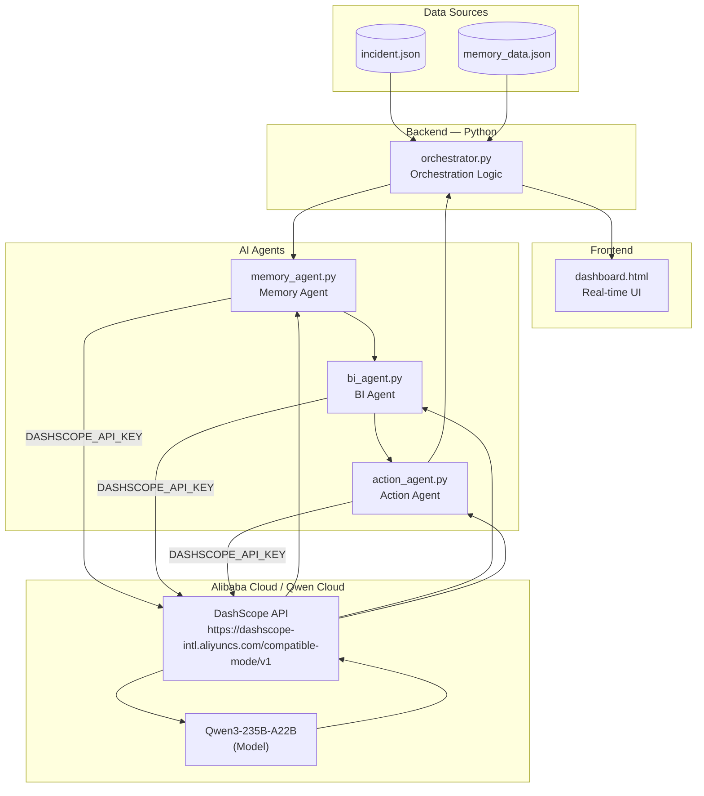

# VEQRA AI — Technical Architecture

**Qwen Cloud Global AI Hackathon — Track: MemoryAgent**

This document describes the technical architecture of VEQRA AI, a multi-agent incident resolution platform powered by **Qwen3-235B-A22B** via the **Alibaba Cloud DashScope** API.

---

## Overview

VEQRA AI orchestrates three specialized AI agents — a **Memory Agent**, a **BI Agent**, and an **Action Agent** — to detect, analyze, and resolve enterprise-critical incidents (e.g. VIP leasing payment issues) in seconds instead of hours. All reasoning is performed by **Qwen3-235B-A22B**, called through the Alibaba Cloud DashScope OpenAI-compatible endpoint.

---

## Components

| Layer | File | Responsibility |
|---|---|---|
| **Frontend** | `dashboard.html` | Real-time visualization of the incident, agent statuses, and executive summary |
| **Backend / Orchestrator** | `orchestrator.py` | Loads incident + historical data, sequentially invokes the three agents, builds the executive summary |
| **Memory Agent** | `memory_agent.py` | Finds similar past incidents, identifies root cause, returns confidence level |
| **BI Agent** | `bi_agent.py` | Computes financial impact, remaining SLA, criticality, urgency score |
| **Action Agent** | `action_agent.py` | Decides corrective actions (Teams task, email, Power BI update) and final ownership |
| **Data source — incident** | `incident.json` | Current incident under analysis |
| **Data source — history** | `memory_data.json` | Historical resolved incidents used for similarity matching |
| **AI Provider** | Alibaba Cloud DashScope | OpenAI-compatible inference endpoint hosting Qwen models |
| **Model** | `qwen3-235b-a22b` | Large language model performing all agent reasoning |

---

## Architecture Diagram



---

## Data Flow

1. `orchestrator.py` loads `incident.json` (current incident) and `memory_data.json` (historical incidents).
2. **Memory Agent** receives both datasets, calls Qwen3-235B-A22B via DashScope, and returns the most similar past case, its root cause, and a confidence level.
3. **BI Agent** receives the incident and the Memory Agent's output, calls Qwen3-235B-A22B, and returns the estimated financial impact, remaining SLA, criticality, and urgency score.
4. **Action Agent** receives the incident plus both prior analyses, calls Qwen3-235B-A22B, and returns the prioritized corrective actions (Teams task, email, Power BI dashboard update) and the final responsible owner.
5. `orchestrator.py` aggregates all three outputs into an executive summary, optionally rendered by `dashboard.html`.

---

## AI Provider Integration

All three agents use the `openai` Python SDK configured to point at Alibaba Cloud's OpenAI-compatible DashScope endpoint:

```python
client = OpenAI(
    api_key=os.environ.get("DASHSCOPE_API_KEY"),
    base_url="https://dashscope-intl.aliyuncs.com/compatible-mode/v1"
)
```

Each agent calls the `qwen3-235b-a22b` model with a structured prompt and parses the JSON response, ensuring deterministic, machine-readable output between agents.

---

## Hackathon Track

**Track: MemoryAgent** — VEQRA AI's Memory Agent is the core differentiator: it grounds every incident response in historical precedent retrieved and reasoned over by Qwen3-235B-A22B, enabling the downstream BI and Action agents to act with context instead of starting from zero.
